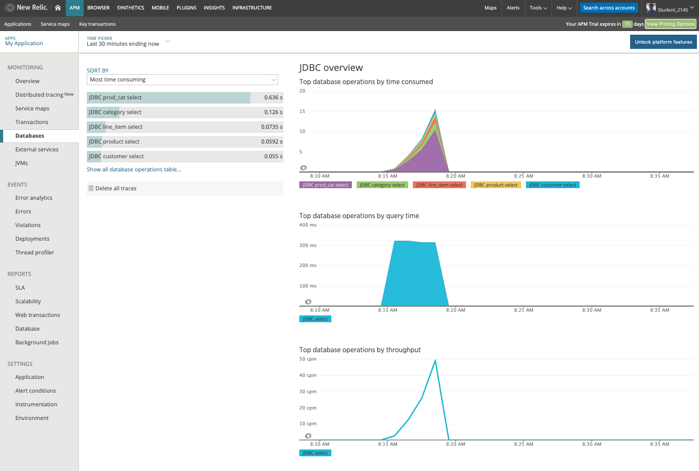

# New Relic Java Agent for tWAS

This readme highlights the work needed in order to add the New Relic Java agent to your tWAS docker image so that you can get JVM metrics and others in your New Relic dashboard.

This work should proceed the work done in [here](https://github.ibm.com/CASE/cloudpak-for-applications/blob/master/tWAS-build.md) for modernising a traditional WebSphere application to run in traditional WebSphere in containers in ICP. Thus, you must complete that work before doing what is outlined here.

## Docker image

First of all, you need to download the New Relic Java agent from your New Relic dashboard UI: https://docs.newrelic.com/docs/agents/java-agent/installation/install-java-agent#

Once we have the zip file, we need to place it in the WebSphere installation directory and unzip it by adding the following to your Dockerfile:
```
COPY --chown=was:0 <local_path>/newrelic-java-5.2.0.zip /tmp
RUN ["unzip", "/tmp/newrelic-java-5.2.0.zip", "-d", "/opt/IBM/WebSphere"]
```

where `<local_path>` is the path where you downloaded the library and `/opt/IBM/WebSphere/` is the WebSphere installation directory within your container.

We also need to pass the [license key for our New Relic account](https://docs.newrelic.com/docs/accounts/install-new-relic/account-setup/license-key). We will pass that license key as an argument to the docker build:

```
ARG NEW_RELIC_LICENSE
RUN sed -i 's/<%= license_key %>/$NEW_RELIC_LICENSE/g' /opt/IBM/WebSphere/newrelic/newrelic.yml
```

where `/opt/IBM/WebSphere/newrelic/newrelic.yml` is the configuration file the New Relic Java Agent will look for at startup time.

Finally, if we are using Java 2 Security and WebSphere, we must grant the Java agent additional permissions before it can execute properly:

```
COPY --chown=was:0 <local_path>/new_relic_java.policy /tmp
RUN cat /tmp/new_relic_java.policy >> /opt/IBM/WebSphere/AppServer/java/8.0/jre/lib/security/java.policy
```

where `<local_path>` is the path in your workstation where you downloaded the  `new_relic_java.policy` file which contains the [additional security permissions](https://docs.newrelic.com/docs/agents/java-agent/installation/install-java-agent-java-2-security#websphere-java-2).

More New Relic Java agent specific information when used for monitoring WebSphere Application Server can be found [here](https://docs.newrelic.com/docs/agents/java-agent/additional-installation/ibm-websphere-application-server)

**IMPORTANT:** while the above instructions have been grouped by topic for the better explanation of what needs to be done, that isn't the correct order in which these instructions must be placed in the Dockerfile. Please, check the final Dockerfile in this repository to see the order the above instructions must be placed.

### Local testing

In order to test your new image locally, you need to provide the `jvm.props` for WebSphere to load these up at startup time and therefore set the New Relic Java agent as a Java Agent. Hence, create a `jvm.props` file with the following:


```
ResourceType=JavaVirtualMachine
ImplementingResourceType=Server
ResourceId=Cell=!{cellName}:Node=!{nodeName}:Server=!{serverName}:JavaProcessDef=:JavaVirtualMachine=
AttributeInfo=jvmEntries
genericJvmArguments=-javaagent:/opt/IBM/WebSphere/newrelic/newrelic.jar

```

With that `jvm.props` created, you need to add this to your Dockerfile:

```
#COPY --chown=was:0 <local_path>/jvm.props /work/config
#RUN /work/configure.sh
```

where `<local_path>` is the path where you created the `jvm.props`, `/work/config` the location where you place the properties files you want WebSphere to pick up at start up time and `/work/configure.sh` the script you need to run in order to configure WebSphere with those properties. For more info see the official tWAS container documentation [here](https://github.com/WASdev/ci.docker.websphere-traditional)


## Build and push docker image

To build your docker image that now includes the Prometheus JMX exporter, just issue the following command:

```
docker build --tag <image>:<tag> --build-arg PASSWORD=<was_admin_password> --build-arg NEW_RELIC_LICENSE=<your_new_relic_license_key> .
```

Re-tag this newly created docker image and push it down to your ICP docker image registry by executing the following commands:

```
docker tag <image>:<tag> <icp_cluster_CA_domain>:8500/<namespace>/<image>:<tag>
docker push <icp_cluster_CA_domain>:8500/<namespace>/<image>:<tag>
```

For more information about pushing images to ICP docker image registry read the official documentation [here](https://www.ibm.com/support/knowledgecenter/en/SSBS6K_3.2.0/manage_images/using_docker_cli.html)


## Run your image in ICP

### jvm properties

In order to run your tWAS docker image that contains your application, we first need inject the `jvm.props` dynamically by defining them in a configmap:

```
apiVersion: v1
kind: ConfigMap
metadata:
  name: jvm-configmap
data:
  jvm.props: |-
    # New Relic Java agent
    ResourceType=JavaVirtualMachine
    ImplementingResourceType=Server
    ResourceId=Cell=!{cellName}:Node=!{nodeName}:Server=!{serverName}:JavaProcessDef=:JavaVirtualMachine=
    AttributeInfo=jvmEntries
    genericJvmArguments=-javaagent:/opt/IBM/WebSphere/newrelic/newrelic.jar
```

Create the configmap by executing:

```
kubectl create -f <name_for_your_configmap>.yaml
```

More information in the helm chart official documentation [here](https://github.com/IBM/charts/tree/master/stable/ibm-websphere-traditional#configure-environment-using-configuration-properties)

### Deploy you helm chart

You are now ready to deploy the traditional WebSphere helm chart that will deploy your application. For more information, read the official documentation [here](https://github.com/IBM/charts/tree/master/stable/ibm-websphere-traditional#install-the-helm-chart).

In our case, we have deployed the application by

1. Adding the ibm helm repository to our local workstation
    ```
    helm repo add stable https://raw.githubusercontent.com/IBM/charts/master/repo/stable
    ```
2. Installing the traditional WebSphere helm chart
    ```
    helm upgrade --install <release_name> --namespace cos ibm-charts/ibm-websphere-traditional -f values.yaml --tls
    ```

where our `values.yaml` looks like:

```
image:
  repository: <icp_cluster_CA_domain>:8500/<namespace>/<image>
  tag: <tag>

ingress:
  enabled: true

configProperties:
  configMapName: "jvm-configmap"
```

You should now be able to access your application through your ICP cluster ingress.

## New Relic Dashboard

You should now see monitoring metrics being displayed in your New Relic dashboard:



